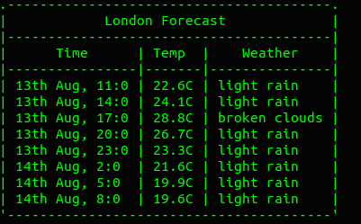

# Deno Weather Forecast

Simple terminal app in Deno to get weather forecast for a city.



## Prerequisite
Install Deno
```sh
curl -fsSL https://deno.land/x/install/install.sh | sh
```

Create an account on https://api.openweathermap.org to get a key for their [5 day forecast API](https://openweathermap.org/forecast5).

Create a *.env* file next to *index.ts* with the following :
```
API_KEY=<your api key>
```

## Usage
```sh
deno run --allow-net --allow-read index.ts --city London
```